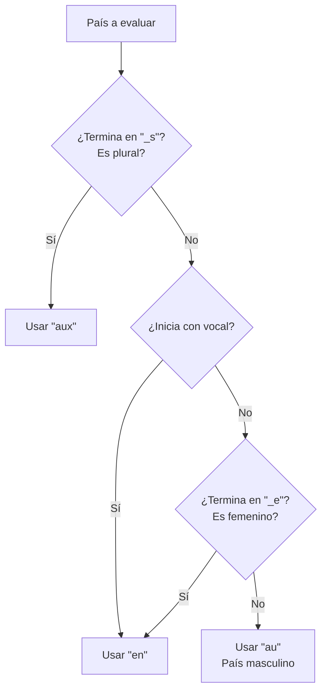
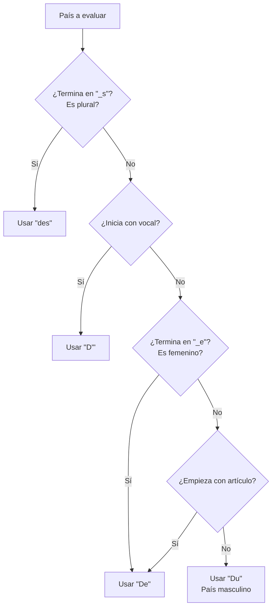

#Francés #LenguaRomance #LenguaRomance 

| [[Idioma]] | Nationalités            | Español (Espagnol) | País (Pays)      |
| ---------- | ----------------------- | ------------------ | ---------------- |
| allemand   | allemand / allemande    | [[Alemán]]         | Allemagne        |
| anglais    |                         | [[Inglés]]         |                  |
| arabe      |                         | [[arábe]]          |                  |
| espagnol   | espagnol /              | [[español]]        |                  |
| hindi      | / indienne              | hindú              |                  |
| japonais   | japonais / japonaise    | japonés            | le Japon         |
| portugais  |                         | [[portugués]]      | le Portugal      |
| coréen     | coréen                  | coreano            |                  |
| français   | français / française    | [[francés]]        | la France        |
| italien    | italien / italienne     | [[italiano]]       |                  |
| mandarin   | chinois / chinoise      | mandarín           |                  |
| suédois    | suédois / suédoise      | [[Sueco]]          |                  |
| russe      | russe                   | [[Ruso]]           |                  |
|            |                         | Irlandéz           | Irlande          |
|            | suisse                  | [[Suiza]]          | la Suisse        |
|            | américain / américaine  | estadunidense      | les États-Unis   |
|            | / kényane               | keniano            |                  |
|            | marocain / marocaine    | marroquí           | le Maroc         |
|            | brésilien / brésilienne | brasileño          | le Brésil        |
|            | mexicain / mexicaine    | mexicano           | le Mexique       |
|            | canadien /              | canadiense         | le Canada        |
|            | / turque                | Turquía            |                  |
|            | blege                   | Bélgica            |                  |
|            | danois / danoise        | danés              |                  |
|            | grec / grecque          | Griego             |                  |
|            |                         | Países bajos       | les Pays-Bas     |
|            |                         | Nueva Zelanda      | Nouvelle-Zélande |
>Femenino -> se agrega una 'e'

## Extras
### Artículos
- Todos los países se acompañan de artículos (con sus excepciones)
	- Si es plural se usa el artículo plural -les- (termina en 's')
	- Si empieza con vocal y no es plural de abrevia a "$l'$"
	- Si termina en 'e' es femenino -la-
		- Excepciones: le Mexique, le Cambodge
	- Excepciones
		- Sin artículo: Madagascar
- Las ciudades no llevan artículo
### Preposiciones
>Se elimina el artículo que lo acompaña
#### Continentes y países
##### Caso 1
>Aplica para [[Verbos-francés|verbos]] aller, habiter, étudier, être

Preguntas a responder:
- Es plural (\_s) -> aux
- Inicia con vocal (voyelle) -> en
- El país es femenino (\_e) -> en
- Ninguna de las anteriores (país masculino) -> au 
>Estas reglas van en esta prioridad

##### Caso 2 - Procedencia
>De procedencia: venir

Preguntas a responder:
- Es plural (\_s) -> des
- Inicia con vocal (voyelle) -> d'
- El país es femenino (\_e) -> de
- País con artículo -> de
- Ninguna de las anteriores (país masculino) -> du 

#### Ville (Ciudad)
##### destino / acción
á -> como el 'en' en [[Español]]
>Si la locación empieza con vocal se usa 'an' (versión femenina)
##### Origine (origen)
De (consonante) / D' (voyelle)